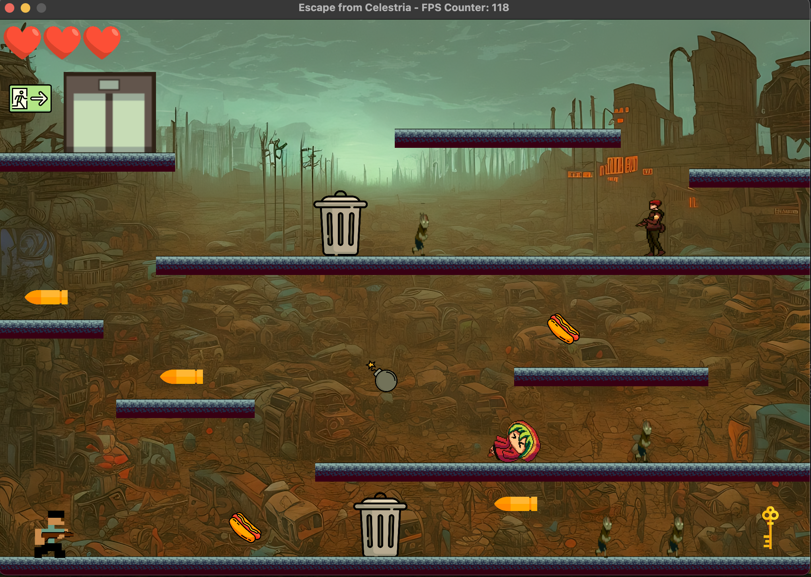
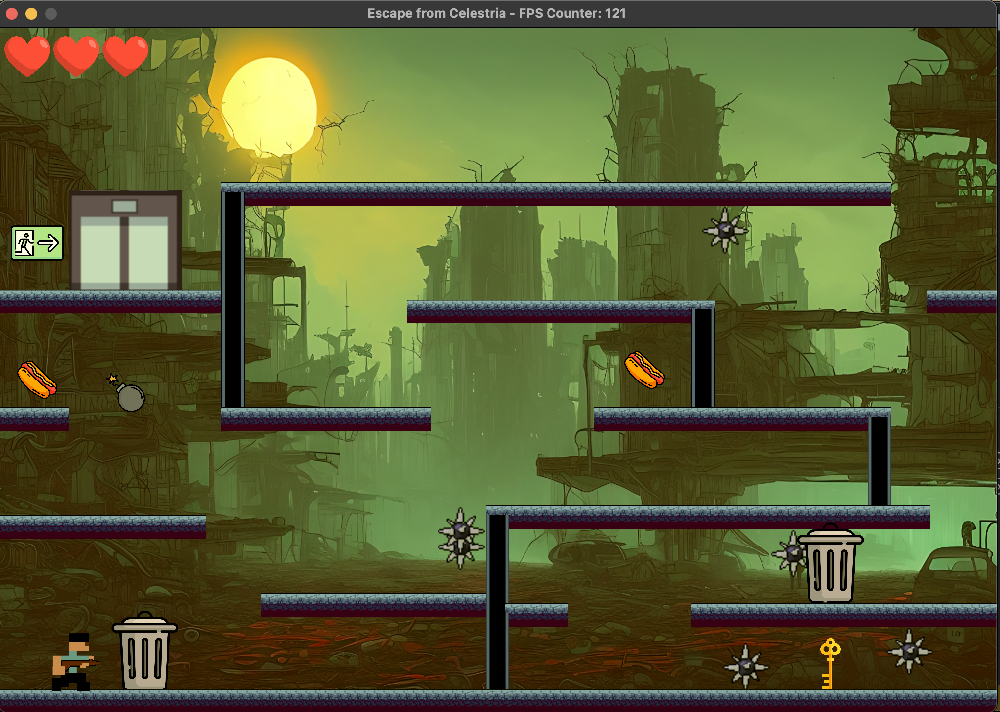

# Escape From Celestria
A 2D platformer strategic game made with C++ and OpenGL for CPSC 427: video game programming.

## Selected gameplay screenshots:

## Main Game Features:
1. **Game AI**:
   <ul>
     <li>Move closer to a zombie from behind, the zombie does not chase the player</li>
     <li>Move closer to a zombie from the front, the zombie will chase the player.</li>
     <li>When a zombie is chasing the player, stay away from it for a short period of time, then it will stop chasing and wander at a normal speed.</li>
     <li>Players can hide in a garbage bin when being chased by zombies. The zombies will stop chasing and start wandering after several seconds.</li>
   </ul>
   
2. **Advanced AI (Pathfinding using A\*)**:
   <ul>
     <li>When the zombie is alerted, it should follow the player.</li>
     <li>When the zombie is chasing the player, it can follow the player and go up and down on the platforms.</li>
   </ul>
3. **Animation**:
   <ul>
     <li>Walking and shooting animation of the main character Josh.</li>
     <li>Walking and death animation of zombies.</li>
   </ul>   
4. **Mesh Based Collision**:\
   The main character Josh is implemented with mesh-based collision: colliding with zombies, platforms, and food.
5. **Complex prescribed motion**:
   <ul>
     <li>Implemented non-linear motion of dynamite using the cubic Bezier curve: B(t) = (1-t)^3*P0+3(1-t)^2*t*P1+3(1-t)t^2*P2+t^3*P3. The motion is controlled using 4 points. </li>
     <li>The dynamite appears in levels 3 and 4</li>
     <li>The player will immediately die when colliding with it.</li>
   </ul>   
6. **Game pause menu & Reloadability**:
   <ul>
     <li>Press ESC to show the pause menu, which shows five options: resume, help, save, load, and quit.</li>
     <li>The game can be saved by pressing save and can be loaded by pressing load in the game pause menu.</li>
     <li>Press the help button to see the help screen.</li>
   </ul>
7. **Audio**:
   <ul>
     <li>Background music</li>
     <li>Audio when entering garbage bins, eating food, doors opening, and shooting.</li>
   </ul>
8. **Dialogue**:
   <ul>
     <li>When Josh encounters an NPC, an automatic dialogue system will start between them.</li>
     <li>When Josh enters a new level, a dialogue will appear to help narrate the story.</li>
   </ul>
9. **Key-frame/state Interpolation**:\
   The main character Josh gradually turns red when he dies. Implemented using linear interpolation.
10. **Well-defined game-space boundaries**:\
    Josh and Zombies won’t walk out of boundaries.
11. **Gravity**:\
    A gravity system is implemented.
12. **FPS counter**:\
    Shown on the game window’s title, displaying the current frames per second.
13. **Assets**:
    <ul>
      <li>Bullets: for shooting</li>
      <li>Hotdogs: add one heart to player's health</li>
      <li>Garbage bin: player can hide inside it to dodge zombies</li>
      <li>Door: player will be able to advance to the next level through the door after obtaining the key</li>
      <li>Key: the key to the door</li>
      <li>Exit sign: a sign indicating where the door is</li>
    </ul>

    
## Requirements
<ul>
  <li>CMake</li>
  <li>GLFW</li>
  <li>SDL</li>
  <li>FreeType</li>
</ul>

`brew install pkg-config glfw3 sdl2 sdl2_mixer freetype`

### Windows
It should be sufficient to open the repository folder (the one containing the CMakeLists.txt) with Visual Studio (you may have to install the VS CMake extension) and press Build.

### Mac
1. Run command: cmake [path_to_project] -DCMAKE_BUILD_TYPE=Release
2. Run command: make
3. Run command: ./game

